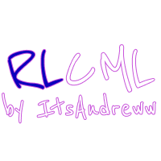
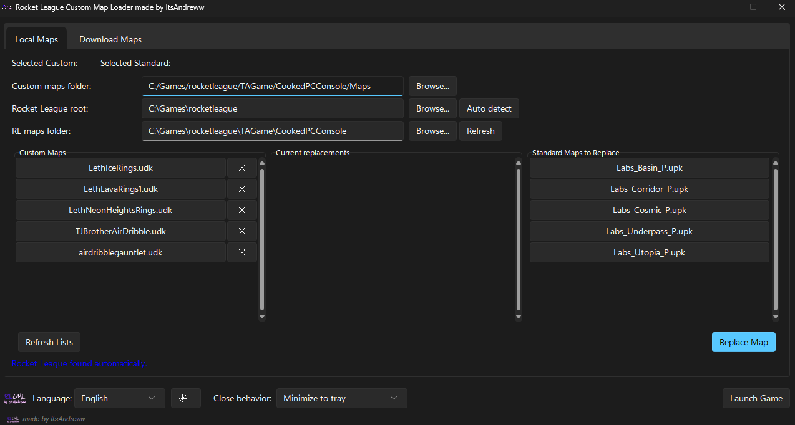
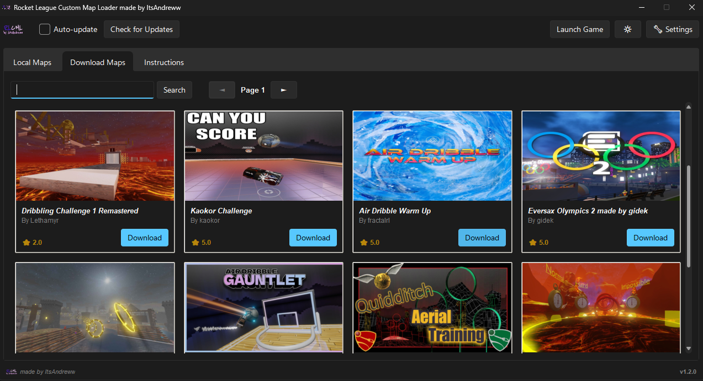

# Rocket League Custom Map Loader
<p align="center">
  
</p>
<h1 align="center">RLCML</h1>

<p align="center">
  <a href="README.md">Англійська версія</a>
  <a href="https://donatello.to/itsandrewini">Підтримати мене</a>
</p>

Утиліта з графічним інтерфейсом для управління користувацькими картами в Rocket League. Ця програма автоматизує процес заміни стандартних ігрових карт на користувацькі, забезпечуючи при цьому автоматичне створення резервних копій, завантаження нових карт безпосередньо з BakkesMod та безпосередній запуск гри.

## Використання

### Автономний виконуваний файл (Exe-файл)

Якщо у вас не встановлено Python, ви можете завантажити останню автономну версію з розділу **Випуски**. Для скомпільованої версії не потрібні додаткові залежності.

## Приклад використання

### Заміна локальної карти



1. Відкрийте вкладку **Локальні карти**.  

2. Вкажіть свою **папку з користувацькими картами**, де ви зберігаєте завантажені файли карт.  

3. Натисніть **Автоматичне виявлення**, щоб програма знайшла шлях до вашої інсталяції Rocket League.  

4. У списку **Користувацькі карти** натисніть на потрібну карту (наприклад, Dribble_Challenge.upk). Кнопка стане синьою, що вказує на вибір.  

5. У списку **Стандартні карти** натисніть на карту, яку потрібно замінити (наприклад, labs_underpass_p). Кнопка стане помаранчевою.  

6. Натисніть **Замінити карту**. Програма автоматично замінить файли та створить резервну копію оригінальної карти.  

7. Натисніть **Запустити гру**, щоб запустити Rocket League з новою встановленою картою та розпочати гру на карті вільного режиму, яку ви замінили (наприклад, Dribble_Challenge.upk -> Labs_Underpass_P.upk або в грі Labs Underpass).

### Завантаження та встановлення нової карти



1. Перейдіть на вкладку **Завантажити карти**.  

2. Введіть запит (наприклад, «Rings») у рядок пошуку та натисніть **Пошук**.  

3. Знайдіть потрібну карту в результатах і натисніть **Завантажити**.  

4. Додаток відкриє браузер у фоновому режимі, обійде Cloudflare та завантажить файл.  

5. Якщо карта знаходиться в **архіві ZIP**, додаток **автоматично розпакує** потрібний файл карти у вказану вами папку для користувацьких карт.  

6. Поверніться на вкладку **Локальні карти** та натисніть **Оновити списки**, щоб побачити вашу нову карту.

## Основні функції

**Заміна карт:** Замінюйте стандартні карти Rocket League на власні файли, зберігаючи автоматичні резервні копії для легкого відновлення.

**Вбудований завантажувач:** Шукайте та завантажуйте карти безпосередньо з BakkesMod із вбудованими зображеннями попереднього перегляду.

**Автоматизований робочий процес:** Автоматичне розпакування ZIP-архівів та інтелектуальне виявлення шляху до інсталяції Rocket League.

**Інтеграція з грою:** Запускайте Rocket League безпосередньо з інтерфейсу з використанням власних аргументів командного рядка (ця функція не працює, можливо, я додам її, коли розберуся).

**Сучасний інтерфейс:** Вбудована підтримка стилю Windows 11 (ефект Mica), перемикання темного/світлого режиму та мінімізація в системний трей.

## Технічна реалізація

**Обхід Cloudflare:** Використовує Selenium для навігації по сайту BakkesPlugins.com та обробки тригерів завантаження.

**Збереження налаштувань:** Налаштування користувача, включаючи мовні налаштування та шляхи до папок, зберігаються локально у файлі config.json.

**Паралельність:** Використовує багатопотоковість, щоб запобігти зависанню інтерфейсу під час мережевих запитів та вилучення файлів.

**Оптимізація PyInstaller:** Включає глобальний патч для subprocess.Popen, щоб гарантувати, що фонові процеси браузера не викликають вікна консолі при компіляції з прапором --noconsole.

**Підтримувані формати:** Обробляє файли .upk, .udk, .pak, .udatasmith та .rli.

## Інструкції зі збірки

Щоб створити автономний однофайловий виконуваний файл з усіма необхідними драйверами та сертифікатами, скористайтеся такою командою:
```bash
python -m PyInstaller --noconsole --onefile --icon=logo.png --add-data «logo.png;.» --collect-all selenium --collect-data certifi map_loader.py
```

### Запуск із вихідного коду (для розробників)

Щоб запустити скрипт безпосередньо, переконайтеся, що у вас встановлено **Python 3.9+** та браузер на базі Chromium (Microsoft Edge або Google Chrome).

**1. Встановіть необхідні залежності:** 
```bash
pip install beautifulsoup4 pillow selenium webdriver-manager pystray sv_ttk pywinstyles
```

**2. Запустіть скрипт:**
python map_loader.py

## Усунення несправностей

**Ініціалізація драйверів:** Якщо програма не може запустити браузер, перевірте ваше інтернет-з'єднання. Програма спробує використати локальні драйвери, перш ніж завантажити найновіші версії через webdriver-manager.  

**Видимість карт:** Стандартні карти, доступні для заміни, наразі обмежені певними картами Labs (наприклад, Underpass, Basin) для забезпечення стабільності гри.  

**Дозволи:** Переконайтеся, що програма має необхідні дозволи на запис у каталог інсталяції Rocket League для заміни карти.

## Ліцензія

Цей проект призначений для особистого та навчального використання. Rocket League є торговою маркою компанії Psyonix.
Автор: ItsAndreww.
Зв’язатися зі мною: andriy.novo05@gmail.com
