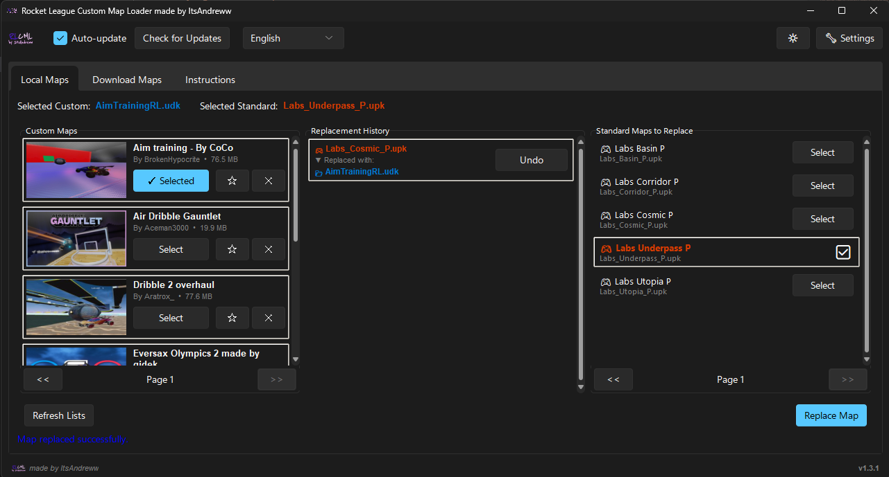
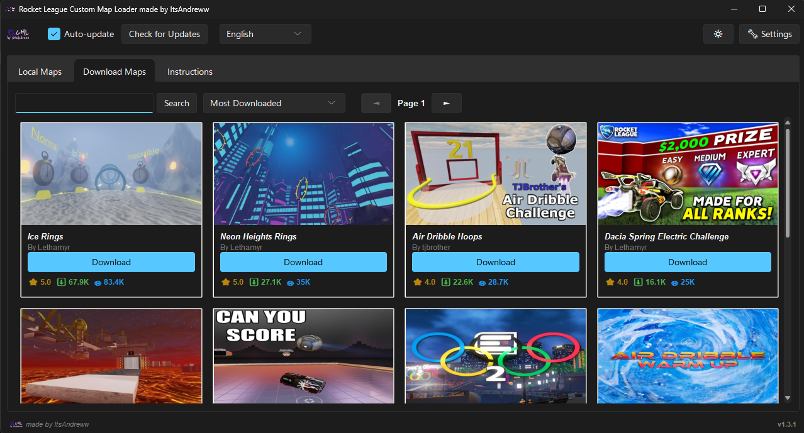

# Rocket League Custom Map Loader
<p align="center">
  
</p>
<h1 align="center">RLCML</h1>

<p align="center">
  <a href="README.md">Англійська інструкція</a> | 
  <a href="https://donatello.to/itsandrewini">Підтримати мене</a>
</p>

Високопродуктивна утиліта з графічним інтерфейсом для керування кастомними картами в Rocket League. Ця програма автоматизує процес заміни стандартних ігрових карт на кастомні зі збереженням автоматичних бекапів, прямим завантаженням нових карт з BakkesMod та можливістю запуску гри безпосередньо з інтерфейсу.

## Використання

### Автономний виконуваний файл (Exe-файл)

Якщо у вас не встановлено Python, ви можете завантажити останню версію у форматі **.exe** з розділу **[Releases](https://github.com/ItsAndreww/Rocket_League_Custom_Map_Loader/releases)**. Для скомпільованої версії не потрібні додаткові залежності. Відразу готова до роботи програма.

## Приклад використання

### Заміна локальної карти



1. Відкрийте вкладку **Локальні карти**.  
2. Вкажіть свою **папку з користувацькими картами**, де ви зберігаєте завантажені файли карт.  
3. Натисніть **Автоматичне виявлення**, щоб програма знайшла шлях до вашої інсталяції Rocket League.  
4. У списку **Користувацькі карти** натисніть на потрібну карту (наприклад, Dribble_Challenge.upk). Кнопка стане синьою, що вказує на вибір.  
5. У списку **Стандартні карти** натисніть на карту, яку потрібно замінити (наприклад, labs_underpass_p). Кнопка стане помаранчевою.  
6. Натисніть **Замінити карту**. Програма автоматично замінить файли та створить резервну копію оригінальної карти.  
7. Натисніть **Запустити гру**, щоб відкрити Rocket League з уже встановленою новою картою, і запустіть режим **Freeplay** на тій стандартній карті, яку ви замінили.

### Завантаження та встановлення нової карти



1. Перейдіть на вкладку **Завантажити карти**.  
2. Введіть запит (наприклад, «Rings») у рядок пошуку та натисніть **Пошук**.  
3. Знайдіть потрібну карту в результатах і натисніть **Завантажити**. Ви також можете переглянути детальний опис мапи, натиснувши кнопку **Деталі**.
4. Програма миттєво отримає карту та завантажить її у фоновому режимі.
5. Якщо карта знаходиться в **архіві ZIP**, додаток **автоматично розпакує** потрібний файл карти у вказану вами папку для кастомних карт.  
6. Поверніться на вкладку **Локальні карти** та натисніть **Оновити списки**, щоб побачити вашу нову карту.

## Основні функції

* **Швидки пошук та прев'ю:** Асинхронне фонове завантаження зображень та швидке отримання карт через API для максимально плавного інтерфейсу.
* **Заміна карт:** Замінюйте стандартні карти Rocket League на власні файли, зберігаючи автоматичні резервні копії для легкого відновлення.
* **Вбудований завантажувач:** Шукайте та завантажуйте карти безпосередньо з BakkesMod із вбудованими зображеннями попереднього перегляду та текстовими описами від авторів.
* **Трекінг часу:** Програма автоматично слідкує, скільки часу ви провели у грі на кожній кастомній мапі, і відображає його поруч із розміром мапи.
* **Автоматизований робочий процес:** Автоматичне розпакування ZIP-архівів та інтелектуальне виявлення шляху до інсталяції Rocket League. Розумне видалення залишкових файлів при видаленні мап.
* **Інтеграція з грою:** Запускайте Rocket League безпосередньо з інтерфейсу.
* **Сучасний інтерфейс:** Вбудована підтримка стилю Windows 11 (ефект Mica), перемикання темного/світлого режиму та мінімізація в системний трей.
* **Автооновлення:** Вбудована перевірка та встановлення оновлень, щоб ви завжди користувалися останньою версією.

## Технічна реалізація

* **Легкий рушій парсингу:** Використовує чисті модулі `urllib` та `BeautifulSoup` для надзвичайно швидкого отримання сторінок та деталей без перевантаження системи драйверами Selenium чи Chromium.
* **Збереження налаштувань:** Налаштування користувача, включаючи мовні налаштування та шляхи до папок, зберігаються локально у файлі `config.json`.
* **Паралельність:** Використовує `threading` та `asyncio`, щоб запобігти зависанню інтерфейсу під час мережевих запитів, завантаження мап та трекінгу фонових процесів гри.
* **Оптимізація I/O:** Використовує кешування в пам'яті для метаданих (`map_info.json`), щоб суттєво зменшити кількість операцій читання/запису на диск.
* **Підтримувані формати:** Обробляє файли `.upk`, `.udk`, `.pak`, `.udatasmith` та `.rli`.

## Інструкції зі збірки

### Автоматизована збірка (GitHub Actions)
Проект налаштовано на роботу з GitHub Actions. Створення нового тегу (наприклад, `v1.2.0`) та відправка його до репозиторію автоматично запустить збірку та опублікує `.exe` файл у розділі Releases.

### Ручна збірка
Щоб створити автономний однофайловий виконуваний файл, скористайтеся такою командою:
```bash
python -m PyInstaller --noconsole --onefile --icon=logo.png --add-data "logo.png;." map_loader.py
```

### Запуск із вихідного коду (для розробників)

Щоб запустити скрипт безпосередньо, переконайтеся, що у вас встановлено **Python 3.9+**.

**1. Встановіть необхідні залежності:** 
```bash
pip install beautifulsoup4 pillow pystray sv_ttk pywinstyles
```

**2. Запустіть скрипт:**
```bash
python map_loader.py
```

## Усунення несправностей

**Видимість карт:** Стандартні карти, доступні для заміни, наразі обмежені певними картами Labs (наприклад, Underpass, Basin) для забезпечення стабільності гри.  

**Дебагінг:** Якщо програма вилітає або не працює належним чином, перегляньте файл `rlcml.log`, який автоматично створюється поруч з `map_loader.py` або `RLCML.exe`.

**Дозволи:** Переконайтеся, що програма має необхідні дозволи на запис у каталог інсталяції Rocket League для заміни карти.

## Ліцензія

Цей проект призначений для особистого та навчального використання. Rocket League є торговою маркою компанії Psyonix.
Автор: **ItsAndreww.**
**Зв’язатися зі мною:** andriy.novo05@gmail.com
Я не беру відповідальність за те що може статись з вашим аккаунтом, користуйтесь з обережністю
